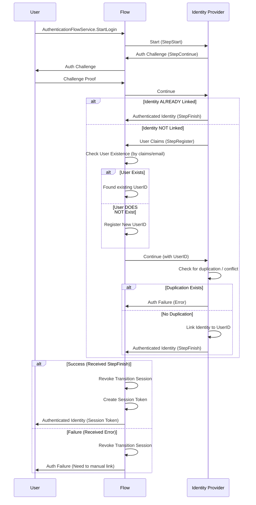

```mermaid
sequenceDiagram
    participant U as User
    participant F as Flow
    participant I as Identity Provider

    U ->> F: AuthenticationFlowService.StartLogin
    F ->> I: Start (StepStart)
    I ->> F: Auth Challenge (StepContinue)
    F ->> U: Auth Challenge

    U ->> F: Challenge Proof
    F ->> I: Continue
    
    %% IdP checks its own linking state first
    alt Identity ALREADY Linked
        I ->> F: Authenticated Identity (StepFinish)
    else Identity NOT Linked
        %% Callback to Flow to resolve UserID
        I ->> F: User Claims (StepRegister)
        
        %% Flow acts as the source of truth for User existence
        F ->> F: Check User Existence (by claims/email)
        alt User Exists
            F ->> F: Found existing UserID
        else User DOES NOT Exist
            F ->> F: Register New UserID
        end
        
        %% Flow returns the resolved UserID back to IdP
        F ->> I: Continue (with UserID)
        
        %% IdP validates the UserID for duplication / linking policies
        I ->> I: Check for duplication / conflict
        
        alt Duplication Exists
            %% e.g., triggering the "need to manual link" logic because the user_id 
            %% already has conflicts or strict linking rules apply
            I ->> F: Auth Failure (Error)
        else No Duplication
            I ->> I: Link Identity to UserID
            I ->> F: Authenticated Identity (StepFinish)
        end
    end

    %% Flow handles the final resolution to the User
    alt Success (Received StepFinish)
        F ->> F: Revoke Transition Session
        F ->> F: Create Session Token
        F ->> U: Authenticated Identity (Session Token)
    else Failure (Received Error)
        F ->> F: Revoke Transition Session
        F ->> U: Auth Failure (Need to manual link)
    end
```
