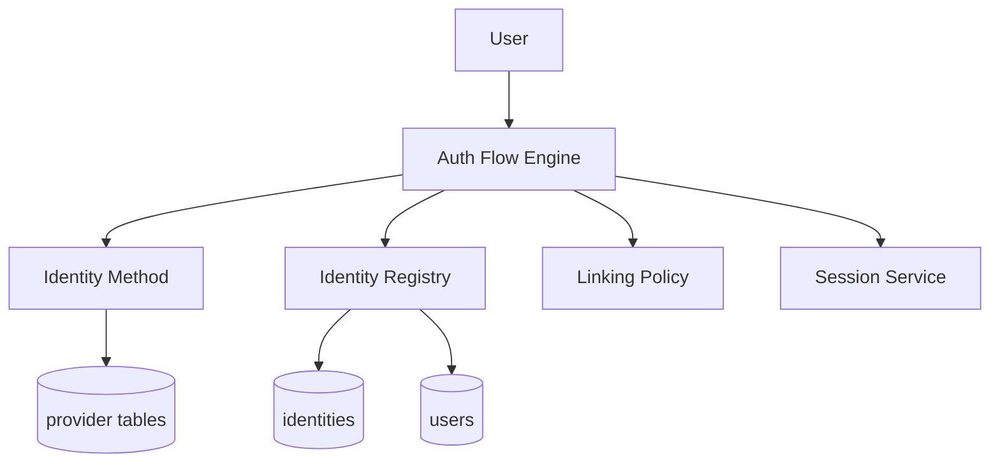
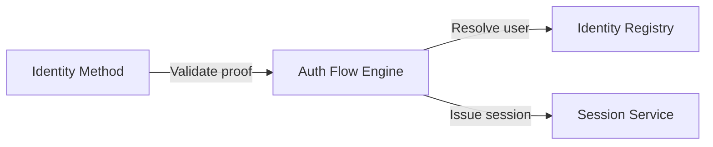
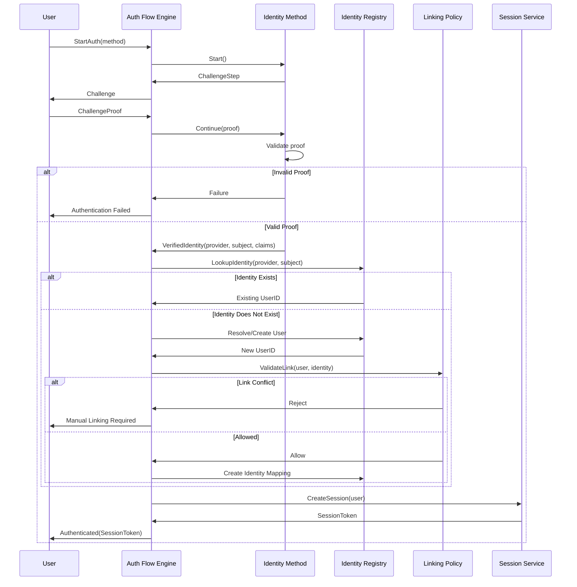
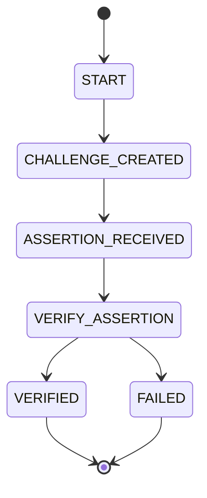
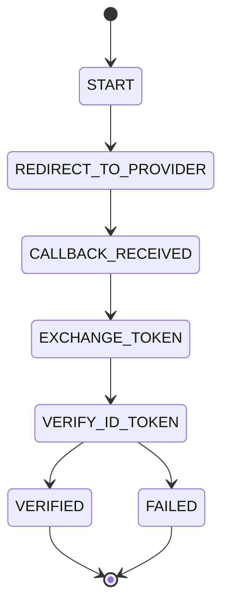
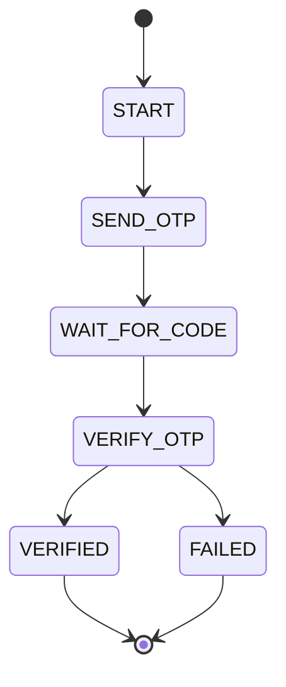
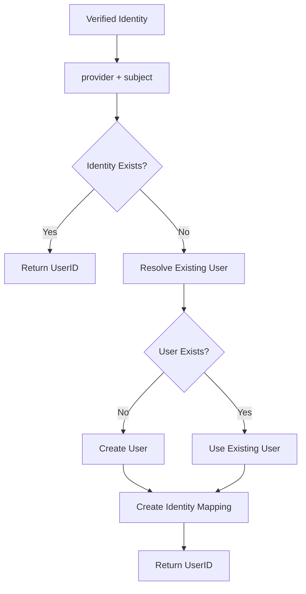
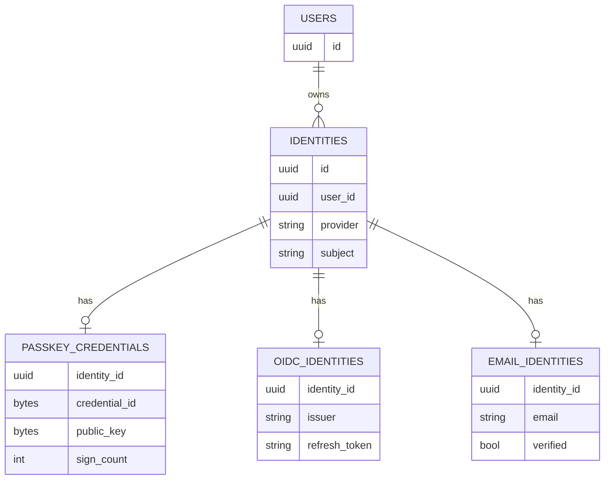
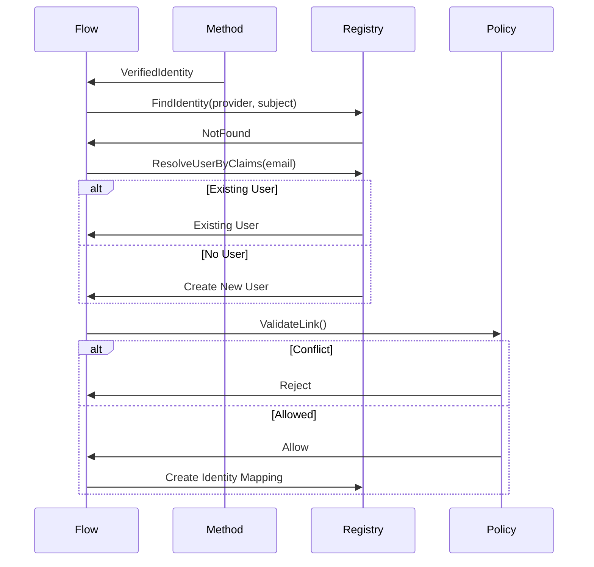
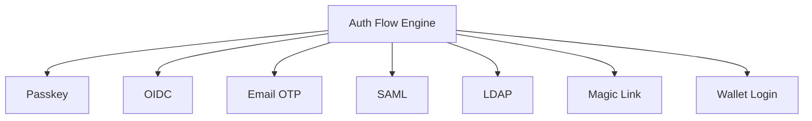

# 1. High-Level Architecture



---

# 2. Responsibility Boundaries



---

# 3. Complete Authentication Flow



---

# 4. Passkey Internal Flow

Passkey method 自己的 protocol state machine：



---

# 5. OIDC Internal Flow



---

# 6. Email OTP Internal Flow



---

# 7. Canonical Identity Resolution Flow

這是 architecture 最重要的部分。



---

# 8. Data Model Relationships



---

# 9. Registration / Linking Flow

當 identity 不存在時：



---

# 10. Future Scalability Model

這個 architecture 最重要的價值：



Flow 永遠只需要：

```text id="9x0jsf"
provider + subject
```

不需要理解任何 provider internals。

---

# 11. Recommended Final Structure

```text id="qt7l37"
Auth Flow Engine
├── Session Lifecycle
├── User Resolution
├── Linking Orchestration
├── Conflict Handling
└── Token Issuance

Identity Methods
├── Passkey
├── OIDC
├── Email OTP
└── Future Providers

Identity Registry
├── identities table
└── provider+subject mapping

Provider Schemas
├── passkey_credentials
├── oidc_identities
└── email_identities
```
